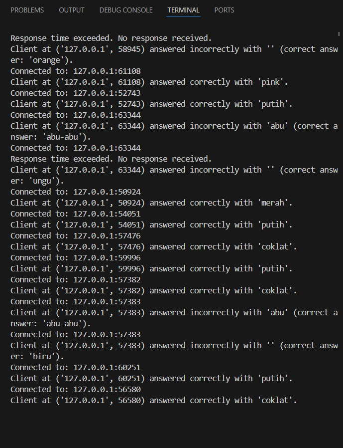
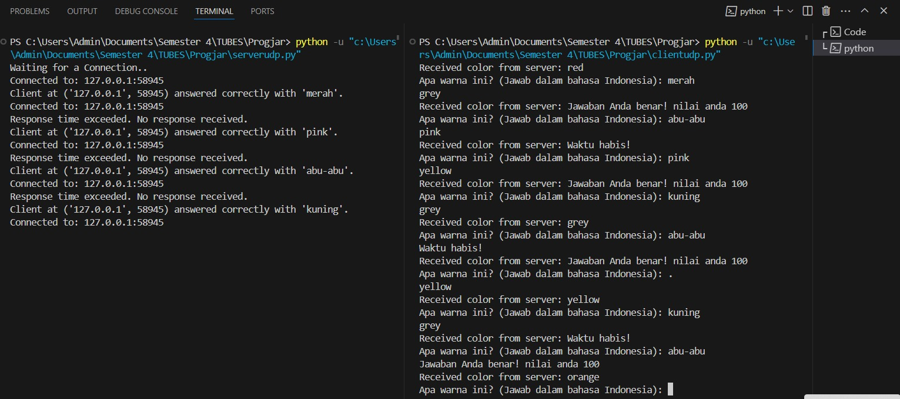
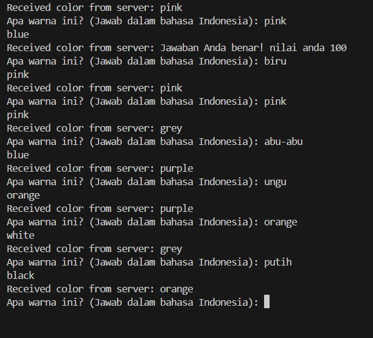
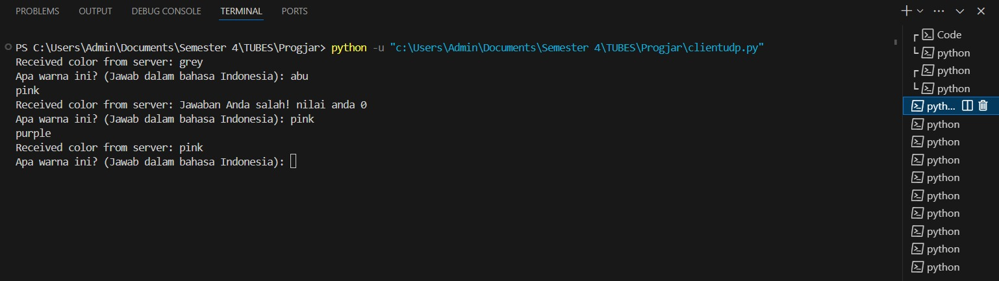
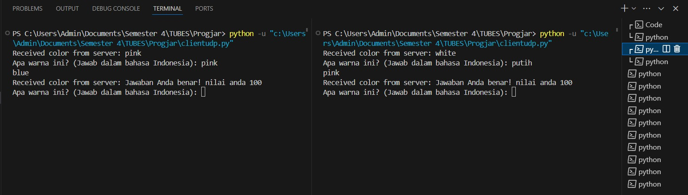

# progjar-UTS

```sh
Nama    : Afifah Fikriyah
Kelas   : IF02-01
NIM     : 1203220051
Prodi   : Informatika
```
## SOAL

Buatlah sebuah permainan yang menggunakan soket dan protokol UDP. Permainannya cukup sederhana, dengan 1 server dapat melayani banyak klien (one-to-many). Setiap 10 detik, server akan mengirimkan kata warna acak dalam bahasa Inggris kepada semua klien yang terhubung. Setiap klien harus menerima kata yang berbeda (unik). Selanjutnya, klien memiliki waktu 5 detik untuk merespons dengan kata warna dalam bahasa Indonesia. Setelah itu, server akan memberikan nilai feedback 0 jika jawabannya salah dan 100 jika benar.


syarat UTS :
- Kerjakan dengan menggunakan bahasa pemrograman python Menggunakan protokol UDP
- Code untuk server dan client dikumpulkan di github - repository masing masing
- Pada readme.md silahkan beri penjelaskan how code works. 
- Pada readme.md silahkan beri screenshoot cara penggunaaan serta contoh ketika program berjalan
- Test case : 1 server 10 client.
- Pastikan memahami soal.
- Silahkan kumpulkan link github repository di assignment ini.
- JANGAN TELAT ! 

## JAWABAN

Untuk program udp singkat dapat dilihat pada server.py dan client.py dan untuk jawaban soal UTS di atas adalah:

1. Server Side 

a. Masukkan Library yang dibutuhkan 

```py 
import socket # koneksi socket digunakan 
import random # ada algoritma yang harus melakukan pengacakan
import threading # ada threading (komunikasi 2 jalan)
import time # library waktu
import sys # library sistem
```

b. Fungsi set timer client 

```py
# Function to set client response timer
def client_response_timer(addr):
    time.sleep(5)  # Client has 5 seconds to respond
    if not response_received.is_set():
        print("Response time exceeded. No response received.")
        feedback = 0
        feedback_lock.acquire()
        try:
            feedbacks[addr] = feedback
        finally:
            feedback_lock.release()
        ServerSocket.sendto(b'Waktu habis!', addr)  # Send "Waktu habis" message to client

```
Pada fungsi ini diset sedemikian rupa agar server dapat memberi waktu 5 detik pada klien untuk menebak, jika tidak ada respon maka server akan mengupdate kondisi "response time exceeded" namun jika klien telat dalam menjawab maka akan mengirimkan pesan "waktu habis"

c. Fungsi stop server 
```py
# Function to stop color sender thread and close server socket
def stop_server():
    global running
    running = False  # set kondisi
    color_sender_thread.join()  # agar dapat mengirim color terus menerus
    ServerSocket.close()  
    sys.exit(0)  

```

d. Deklarasi warna-warna pada sebuah map 

Inggris | Bindo |
| ------ | ------ |
| red | merah |
| yellow | kuning |
| blue | biru |
| orange | orange |
| purple | ungu |
| pink | pink |
| brown | coklat |
| black | ungu |
| white | putih |
| grey | abu-abu |

warna - warna yang digunakan dalam program ini akan dideklarasikan pada sebuah map

e. Fungsi send color semua klien

```py
# Function to send color to all clients
def send_color_to_clients(color):
    for client_addr in clients:
        ClientSocket.sendto(str.encode(color), client_addr)
```
dengan memanfaatkan _sendto_ maka server dapat mengirim sesuatu pada klien

f. Main program 

```py
# Server
ServerSocket = socket.socket(socket.AF_INET, socket.SOCK_DGRAM)
host = '127.0.0.1'
port = 1233

colors = list(color_mapping.keys())

try:
    ServerSocket.bind((host, port))
except socket.error as e:
    print(str(e))

print('Waiting for a Connection..')

feedbacks = {}  
feedback_lock = threading.Lock() 
response_received = threading.Event()  

clients = set()  

# Define ClientSocket
ClientSocket = socket.socket(socket.AF_INET, socket.SOCK_DGRAM)

# Start a thread to continuously send colors to all clients
def color_sender(running):  
    while running:
        random_color = random.choice(colors)
        send_color_to_clients(random_color)
        time.sleep(10)  # set 10 detik ngirim 

color_sender_thread = threading.Thread(target=color_sender, args=(True,))  
color_sender_thread.start()

running = True  # running -> true
while running:
    data, addr = ServerSocket.recvfrom(1024)
    print('Connected to: ' + addr[0] + ':' + str(addr[1]))
    clients.add(addr)  
    
    # Start timer for client response time
    timer_thread = threading.Thread(target=client_response_timer, args=(addr,))
    timer_thread.start()
    
    # Send a random color to the client
    random_color = random.choice(colors)
    ServerSocket.sendto(str.encode(random_color), addr)
    
    # Receive response from the client
    response_received.clear()  # Mark that response is not received yet
    Response, _ = ServerSocket.recvfrom(1024)
    response_received.set()  # Mark that response is received
    
    # Check jawaban klien
    client_answer = Response.decode('utf-8').lower().strip()  # Convert to lowercase and remove whitespace
    correct_answer = color_mapping[random_color]  # Get Indonesian translation of the correct color
    feedback = 100 if client_answer == correct_answer else 0
    
    # feedback ke klien
    feedback_lock.acquire()
    try:
        feedbacks[addr] = feedback
    finally:
        feedback_lock.release()
    
    # cek benar 
    if feedback == 100:
        print("Client at {} answered correctly with '{}'.".format(addr, client_answer))
        ServerSocket.sendto(b'Jawaban Anda benar! nilai anda 100', addr)
    else:
        print("Client at {} answered incorrectly with '{}' (correct answer: '{}').".format(addr, client_answer, correct_answer))
        ServerSocket.sendto(b'Jawaban Anda salah! nilai anda 0', addr)

# stop server
stop_server()
```

pada main program terdapat pembuatan objek socket udp yang ditandai dengan _SOCK_DGRAM_ dengan seluruh konfigurasi kemudian mencoba mencari koneksi 

pada kode di atas juga dijelaskan bagaimana thread dapat membantu permainan tebak warna antar klien dan server seperti mengirim feedback, dan juga mengoreksi jawaban dari klien

2. Client Side 

a. Masukkan library yang dibutuhkan

```py
import socket # socket akan digunakan
import sys # library system

```

b. Deklarasi Warna dalam sebuah map 

```py
# Membuat pemetaan antara warna dalam bahasa Indonesia dan bahasa Inggris
color_mapping = {
    'merah': 'red',
    'kuning': 'yellow',
    'biru': 'blue',
    'orange': 'orange',
    'ungu': 'purple',
    'pink': 'pink',
    'coklat': 'brown',
    'hitam': 'black',
    'putih': 'white',
    'abu-abu': 'grey'
}
```

c. Main Program 

```py
# Client
ClientSocket = socket.socket(socket.AF_INET, socket.SOCK_DGRAM)
host = '127.0.0.1'
port = 1233

# Pesan Kosong
ClientSocket.sendto(b'', (host, port))

running = True
while running:
    # Menerima warna dari server
    Response, addr = ClientSocket.recvfrom(1024)
    color = Response.decode('utf-8')
    print("Received color from server:", color)
    
    # Tebak-tebakan sisi klien dimulai
    answer = input("Apa warna ini? (Jawab dalam bahasa Indonesia): ")
    
    # Mengirim jawaban pengguna ke server
    ClientSocket.sendto(str.encode(answer), (host, port))
    
    # Menerima feedback dari server
    feedback, _ = ClientSocket.recvfrom(1024)
    print(feedback.decode('utf-8'))
    

ClientSocket.close()
sys.exit(0)  

```

Pada program ini, diawali dengan pembuatan objek socket UDP (sama seperti server di atas), dilanjut mengirimkan pesan kosong yang isinya host dan port untuk server dan ketika loop berlangsung klien akan menerima warna dari server, yang kemudian klien akan menebak warna tersebut ke dalam bahasa indonesia lalu mengirimkan jawaban kepada server dan menerima feedback dari server

## Dokumentasi Program 

a. satu server untuk banyak klien

 

 Di sini serverudp.py sudah dijalankan dan klien pada clientudp.py juga dijalankan, pada program ini thread dimanfaatkan agar server dapat menerima banyak koneksi, dapat dilihat terdapat banyak sekali klien yang terhubung dari 58945,61108,52743, dan seterusnya

 b. klien menebak warna server 
 
 

 Nah di sini, klien menerima warna red dari server dan kemudian ditebak dalam bahasa indonesia di klien, jika benar maka server mengirim feedback nilai 100 pada klien.

 Tidak hanya itu, ketika klien menebak pada waktu habis maka juga akan mengirimkan pesan waktu habis, namun klien masih dapat menebak 

 Di sinilah UDP bekerja, ketika waktu habis asalkan setiap 10 detik maka server akan mengirimkan warna pada klien tanpa peduli klien sudah menebak atau belum 

 c. Sistem UDP
 
 

 Ketika klien telat cukup lama maka prinsip udp yang terus menerus mengirim warna terus dilakukan, bahkan pengoreksian pun jadi tertumpuk dan tidak dapat dilakukan karna klien terlalu lama dalam menjawab 

 d. Klien menebak tapi salah 

 

 Ketika klien salah dalam menebak maka server akan mengirim nilai 0 pada klien 

 e. Server mengirim warna berbeda pada setiap klien

 

 Dengan memanfaatkan library random, maka dengan lancar server dapat mengirimkan warna secara acak pada setiap klien yang terhubung


 


